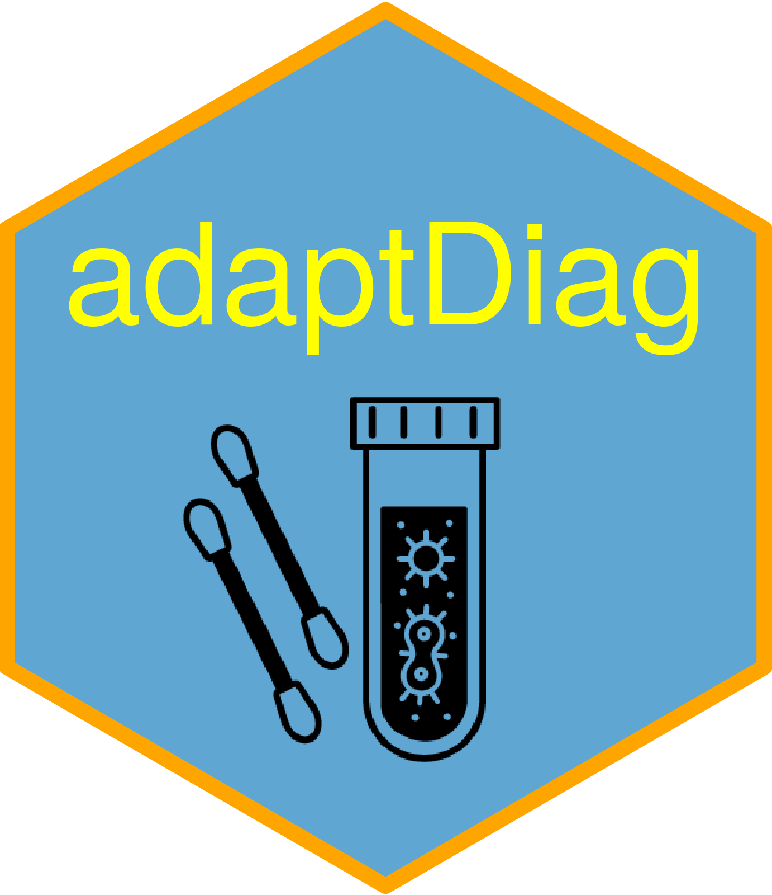

<!-- README.md is generated from README.Rmd. Please edit that file -->

```{r, include = FALSE}
knitr::opts_chunk$set(
  collapse = TRUE,
  comment = "#>",
  fig.path = "man/figures/README-",
  out.width = "100%"
)
```

# adaptDiag 

<!-- badges: start -->
[](https://CRAN.R-project.org/package=adaptDiag)
[](https://github.com/graemeleehickey/adaptDiag/actions)
<!-- badges: end -->

The goal of `adaptDiag` is to simplify the process of designing adaptive trials
for diagnostic test studies. With accumulating data in a clinical trial of a new
diagnostic test compared to a gold-standard reference, decisions can be made at
interim analyses to either stop the trial for early success, stop the trial for
expected futility, or continue to the next sample size look. Designs can be
focused around test sensitivity, specificity, or both. The package is heavily
influenced by the seminal article Broglio et al. (2014).

## References

Broglio KR, Connor JT, Berry SM. Not too big, not too small: a Goldilocks
approach to sample size selection. *Journal of Biopharmaceutical Statistics*,
2014; **24(3)**: 685–705.

## Installation

You can install the development version of `adaptDiag`
[GitHub](https://github.com/) with:

```{r eval=FALSE}
# install.packages("devtools")
devtools::install_github("graemeleehickey/adaptDiag")
```
