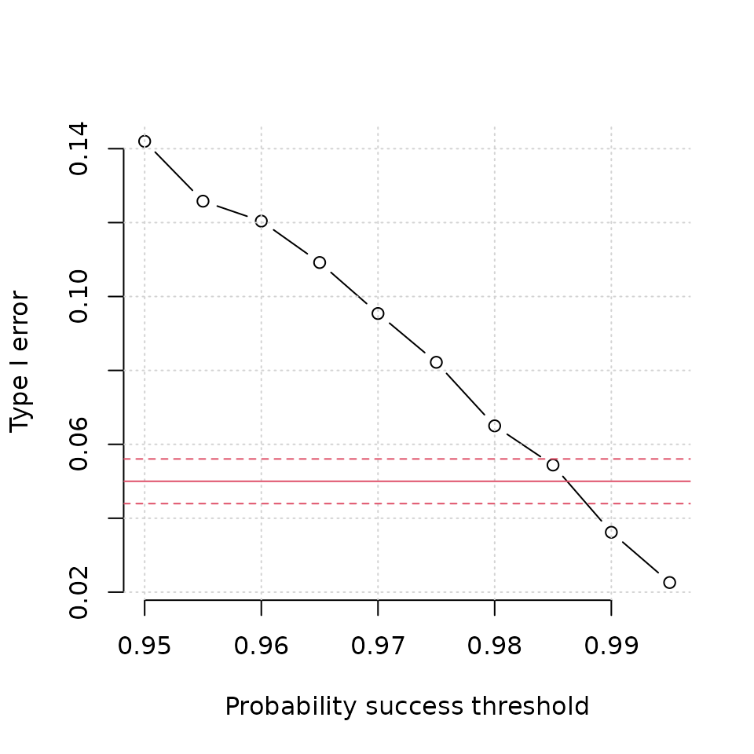

# Type I error control

``` r

library(adaptDiag)
```

For studies that incorporate multiple looks, it is usually necessary to
control the type I error by ensuring the success threshold is
sufficiently large that the overall type I error is controlled at the
required level. When incorporating a futility stopping rule that is
binding and based on posterior predictive probabilities, it can
ameliorate the inherent type I error inflation. However, to what degree
is unknown, and there are no simple formulae to calculate this. It is
therefore necessary to use simulation methods to tune the threshold

## Example

Assume we want to compare a new test to a gold standard reference. The
gold standard reference is expensive and invasive, meaning that if the
new test was reliable, it would be cost effective. It is required that
the new test have sensitivity $`>0.7`$ with high probability. In
designing the study, the sponsor would like a sample size to have 90%
power to reject the null hypothesis at $`\alpha = 0.05`$:

``` math
H_0: \pi_1 \le 0.7 \, \text{vs.} \, H_1: \pi > 0.7.
```

Based on an exact binomial sample size calculation, and assuming no
interim looks, we can determine the sample size we would need assuming
the true sensitivity is 0.824. The value of 0.824 derives from the
sensitivity point estimate from a pilot study. The following tells us
the number of reference-positive cases we would need:

``` r

library(adaptDiag)

ss <- binom_sample_size(alpha = 0.05, power = 0.9, p0 = 0.7, p1 = 0.824)
ss
#> $successes
#> [1] 81
#> 
#> $N
#> [1] 104
```

It is necessary to adjust the sample size to allow for
reference-negative cases. If we assume the true prevalence is 20%, then
we would need a sample size of 104 / 0.2 $`=`$ 520. Using this sample
size, the sponsor proposes to run multiple early looks under a Bayesian
framework subject to the following conditions:

1.  The trial stops for futility if the posterior predictive probability
    of eventual success is \<5%.
2.  The trial cannot stop early if the number of reference positive
    cases is \<35.
3.  The trial stops for early success if the probability of success is
    sufficiently high, such that the type I error is controlled at the
    5% level.
4.  The trial will make interim analyses at $`n =`$ 100, 150, 200, …,
    550, 600.
5.  The expected specificity is 0.963. This parameter is needed for
    simulation of the cases where $`n_\text{max}`$ is reached.

The probability threshold for early success is unknown at this point,
hence it is necessary to explore a range of values to explore at what
value the type I error is controlled.

## Simulations

We can create a grid of success probability thresholds ranging from
0.950 up to 0.995 as

``` r

p_thresh <- seq(0.95, 0.995, 0.005)
```

For each probability determine the type I error. **Note**: the code
below takes about 20 minutes to run.

``` r

tab <- NULL

for (i in 1:length(p_thresh)) {
  fit_p <- multi_trial(
    sens_true = 0.7,
    spec_true = 0.963,
    prev_true = 0.20,
    endpoint = "sens",
    sens_pg = 0.7,
    spec_pg = NULL,
    prior_sens = c(0.1, 0.1),
    prior_spec = c(0.1, 0.1),
    prior_prev = c(0.1, 0.1),
    succ_sens = p_thresh[i],
    n_at_looks = seq(100, 600, 50),
    n_mc = 10000,
    n_trials = 5000,
    ncores = 8L)

  out <- summarise_trials(fit_p, min_pos = 35, fut = 0.05)
  tab <- rbind(tab, out)
}
```

With this, we can look at the type I error by success threshold.

``` r

plot(p_thresh, tab$power,
     xlab = "Probability success threshold",
     ylab = "Type I error",
     main = "",
     type = "b",
     bty  = "n")
grid()
abline(h = 0.05, col = 2)
abline(h = 0.05 + 1.96 * sqrt(0.05 * 0.95 / 5000),
       col = 2, lty = 2)
abline(h = 0.05 - 1.96 * sqrt(0.05 * 0.95 / 5000),
       col = 2, lty = 2)
```



The solid red line is the intended level of type I error (5%). The
dashed red lines either side denote a 95% confidence interval assuming a
true type I error of 0.05 with 5000 simulations (as was the case here).
We can see that a probability threshold of 0.985 would sufficient
control the type I error at the 5% level. The empirically calculated
type I error from the simulations in 0.0544.

Once we have determined the threshold required, we can calculate the
power.

``` r

power <- multi_trial(
    sens_true = 0.824,
    spec_true = 0.963,
    prev_true = 0.20,
    endpoint = "sens",
    sens_pg = 0.7,
    spec_pg = NULL,
    prior_sens = c(0.1, 0.1),
    prior_spec = c(0.1, 0.1),
    prior_prev = c(0.1, 0.1),
    succ_sens = 0.985,
    n_at_looks = seq(100, 600, 50),
    n_mc = 10000,
    n_trials = 5000,
    ncores = 8L)
```

``` r

summarise_trials(power, min_pos = 35, fut = 0.05)
#>                    n
#> decision             100  150  200  250  300  350  400  450  500  550  600
#>   early win            2  345 1364  830  457  383  341  272  194  146    0
#>   late win             0    0    0    0    0    0    0    0    0    0   92
#>   no stopping          0    0    0    0    0    0    0    0    0    0  117
#>   stop for futility    0    8   82   70   47   44   35   45   62   64    0
#>    power stop_futility  n_avg      sens      spec mean_pos
#> 1 0.8852        0.0914 305.99 0.8391559 0.9636968  61.2376
```

The design provides slightly less than 90% power overall. However, on
average, the design also only requires 306 subjects, which is far less
than the 520 required under a classical design.
