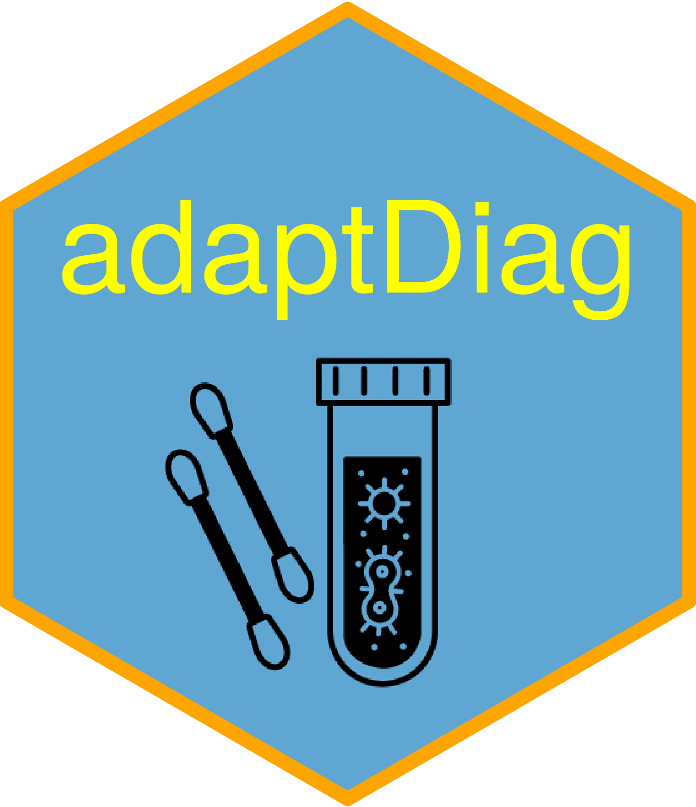

# adaptDiag 

The goal of `adaptDiag` is to simplify the process of designing adaptive
trials for diagnostic test studies. With accumulating data in a clinical
trial of a new diagnostic test compared to a gold-standard reference,
decisions can be made at interim analyses to either stop the trial for
early success, stop the trial for expected futility, or continue to the
next sample size look. Designs can be focused around test sensitivity,
specificity, or both. The package is heavily influenced by the seminal
article by Broglio et al. (2014).

## References

Broglio KR, Connor JT, Berry SM. Not too big, not too small: a
Goldilocks approach to sample size selection. *Journal of
Biopharmaceutical Statistics*, 2014; **24(3)**: 685–705.

## Installation

You can install the development version of `adaptDiag`
[GitHub](https://github.com/) with:

``` r

# install.packages("devtools")
devtools::install_github("graemeleehickey/adaptDiag")
```
